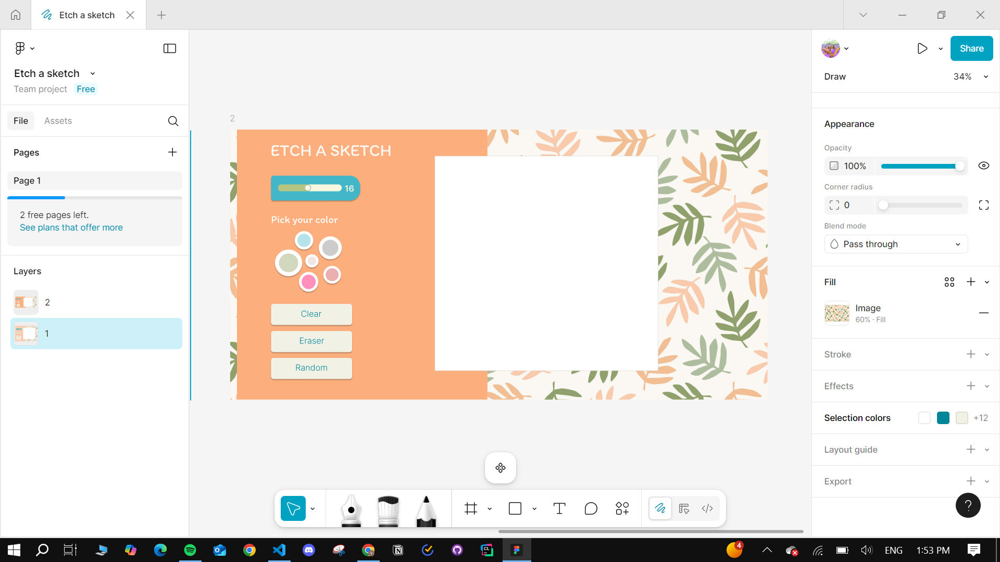

# Etch A Sketch

## Overview

**Etch A Sketch** is a creative web-based drawing application built as part of [The Odin Project](https://www.theodinproject.com/) curriculum for learning web development.

The goal of the project was to practice JavaScript DOM manipulation, event handling, layout design, and **Flexbox** to create an interactive and visually appealing sketching tool.

---

## Features

- **Dynamic Grid Drawing**  
  The grid is dynamically generated using JavaScript and can be resized using a slider and number input.

- **Colorful Flower Palette**  
  A 6-color palette is arranged in the shape of a **flower** to match the playful and colorful design. Each color can be customized by the user.

- **Random Color Mode**  
  A "Random" button enables color randomization while drawing.

- **Clear Button**  
  Resets the entire grid to its original blank state.

- **Eraser Tool**  
  Allows users to erase drawn colors by returning squares to white.

- **Darken Effect**  
  Each time the cursor passes over a colored square, it darkens by 10% until it becomes black.

---

## UI Design

The user interface was first designed using **Figma** to ensure a clean, modern, and user-friendly look. The layout and color scheme were carefully planned to reflect a **fun and colorful experience** for the user.

---

## Technologies Used

- HTML
- CSS (with Flexbox layout)
- JavaScript (DOM Manipulation)
- Figma (for design planning)

---

## Project Purpose

This project helped reinforce key web development concepts such as:

- Creating and modifying DOM elements
- Handling user events like clicks and hovers
- Using sliders and inputs for dynamic interactivity
- Applying CSS styles with JavaScript
- Practicing Flexbox layout for responsive design
- Planning a design-first workflow using Figma

---

## Screenshot

